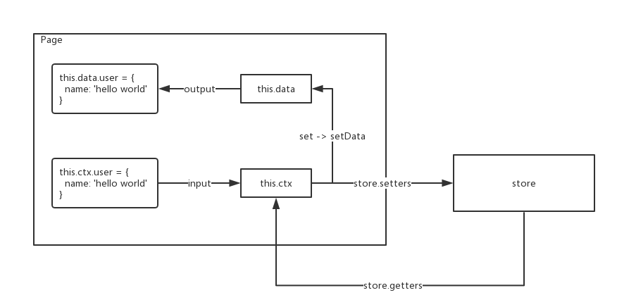

# 小程序开发模版

async/await，数据代理（setData），数据中心（store）

## 目录

+ pages 页面
+ runtime 运行环境
  + index 入口文件
  + proxy 数据代理，直接赋值取代setData
  + regenerator async/await
  + wx 封装wx自身api
+ store 数据中心（跨页面使用）
  + index 入口文件
  + proxy 扩展数据代理，关联 store 和 runtime/proxy
  + getters 设置store.getters
  + setters 设置store.setters

## 数据流程图

